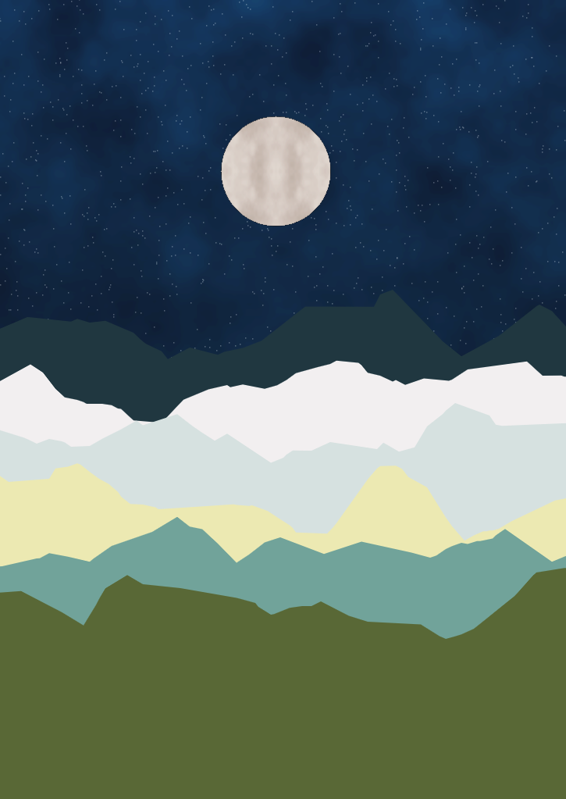

# p5js-learning

This repository is dedicated to sharing my p5.js work and any knowledge about p5.js.

This repository contains many examples, such as the following broad categories:

- Text effects
- Generative Art
- Looping animations
- Machine learning API
- Math
- Music visualization
- Painting
- Simulation of natural systems
- Other

A very wide range of topics are covered for your reference. If you are planning to get started with p5.js real you have come to the right place.

---

## Catalogue

### [P5 Painting](./P5_Painting/README.md)

Things like landscapes, botanicals, abstracts and other artwork created with p5.js will go in this catalogue.

| 001_MountainAtNight                                | 002_Lotus                                | 006_BloodForestUnderTheMoon                                |
| -------------------------------------------------- | ---------------------------------------- | ---------------------------------------------------------- |
|  |  |  |

### [P5 Font](./P5_Font/README.md)

The text, text-related p5.js works will be placed in this catalogue.

| 001_WoolFont                            | 002_NeonFont                            | 003_TextPosterLoopAnimation                            |
| --------------------------------------- | --------------------------------------- | ------------------------------------------------------ |
|  |  |  |

| 004_TextParticleLoopAnimation                            | 005_TextFlowAnimation                            | 006_TextMatrixAnimation                            |
| -------------------------------------------------------- | ------------------------------------------------ | -------------------------------------------------- |
|  |  |  |

### [P5 Generative Art](./P5_Generative_Art/README.md)

The generative art is the art of using computer programming, which meaningfully introduces randomness as a part of its creative process.

| 001_TriangleNestedPattern                                      | 002_RectangleComposition                                      |
| -------------------------------------------------------------- | ------------------------------------------------------------- |
|  |  |

### [P5 Math](./P5_Math/README.md)

Some of the mathematical experiments done with p5.js will be placed in this catalogue.

| 001_Lissajous                            |     |
| ---------------------------------------- | --- |
|  |     |

### [P5 Music Visualization](./P5_Music_Visualization/README.md)

All p5.js music compositions will be placed in this catalogue.

| 001_RandomCurve                                           | 002_SoundWaves                                           |
| --------------------------------------------------------- | -------------------------------------------------------- |
|  |  |
