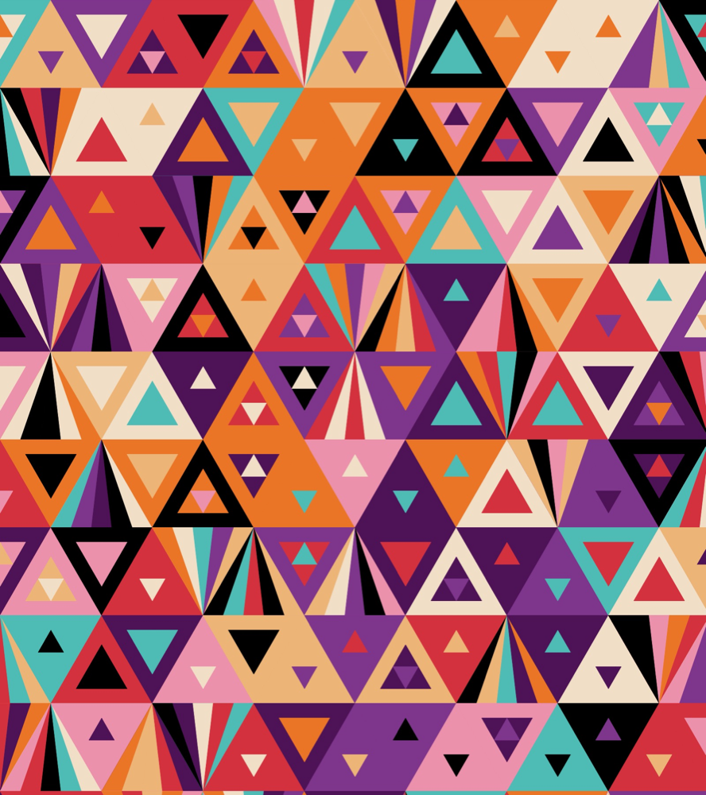

# p5.js 学习

[View English](./README.en-US.md)

这个仓库专门于分享我的 p5.js 作品和任何关于 p5.js 的知识。

这个仓库包含很多例子，比如以下几个大类。

- 文字
- 生成艺术
- 循环动画
- 机器学习 API
- 数学
- 音乐可视化
- 自然印象派
- 自然系统的模拟
- 其他

本仓库涵盖了非常广泛的话题供您参考。如果你打算开始学习 p5.js，你就来对地方了。

---

## 目录

### [自然印象派](./P5_Natural_Impressionism/README.md)

用 p5.js 创作的山水树木相关的艺术作品都会放在这个目录里。

| 001_MountainAtNight                                             | 002_Lotus                                             | 006_BloodForestUnderTheMoon                                             |
| --------------------------------------------------------------- | ----------------------------------------------------- | ----------------------------------------------------------------------- |
|  |  |  |

### [文字类](./P5_Font/README.md)

与文本相关的 p5.js 作品将放在这个目录中。

| 001_WoolFont                            | 002_NeonFont                            | 003_TextPosterLoopAnimation                            |
| --------------------------------------- | --------------------------------------- | ------------------------------------------------------ |
|  |  |  |

| 004_TextParticleLoopAnimation                            | 005_TextFlowAnimation                            | 006_TextMatrixAnimation                            |
| -------------------------------------------------------- | ------------------------------------------------ | -------------------------------------------------- |
|  |  |  |

### [生成艺术](./P5_Generative_Art/README.md)

生成艺术是使用计算机编程的艺术，它有意义引入随机性作为其创作过程的一部分。

| 001_TriangleNestedPattern                                      | 002_RectangleComposition                                      |
| -------------------------------------------------------------- | ------------------------------------------------------------- |
|  |  |

### [数学](./P5_Math/README.md)

用 p5.js 完成的一些数学实验将放在这个目录中。

| 001_Lissajous                            | 002_RoseCurve                            |
| ---------------------------------------- | ---------------------------------------- |
|  |  |

### [音乐可视化](./P5_Music_Visualization/README.md)

所有 p5.js 音乐作品都将放在这个目录中。

| 001_RandomCurve                                           | 002_SoundWaves                                           |
| --------------------------------------------------------- | -------------------------------------------------------- |
|  |  |

## 群聊

**微信搜索 ChihYungChang 拉你入群**

