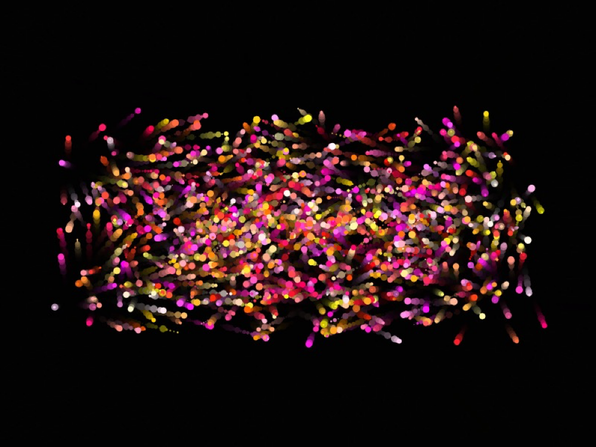

# p5js-learning

[查看中文](./README.zh-CN.md)

This repository is dedicated to sharing my p5.js work and any knowledge about p5.js.

This repository contains many examples, such as the following broad categories:

- Plants, landscape coding ideas
- Text effects
- Geometric patterns
- Looping animations
- Music visualization
- Noise
- Simulation of natural systems
- Machine learning API

A very wide range of topics are covered for your reference. If you are planning to get started with p5.js real you have come to the right place.

---

## Catalogue

### [P5 Art](./P5_Art/README.md)

Things like landscapes, botanicals, abstracts and other artwork created with p5.js will go in this catalogue.

| 001_MountainAtNight                           | 002_Lotus                           | 005_ColorTree                           |
| --------------------------------------------- | ----------------------------------- | --------------------------------------- |
|  |  |  |

### [P5 Font](./P5_Font/README.md)

The text, text-related p5.js works will be placed in this catalogue.

| 002_NeonFont                            | 003_TextLoopAnimationPoster                            | 004_TextParticleLoopAnimation                            |
| --------------------------------------- | ------------------------------------------------------ | -------------------------------------------------------- |
|  |  |  |

·
