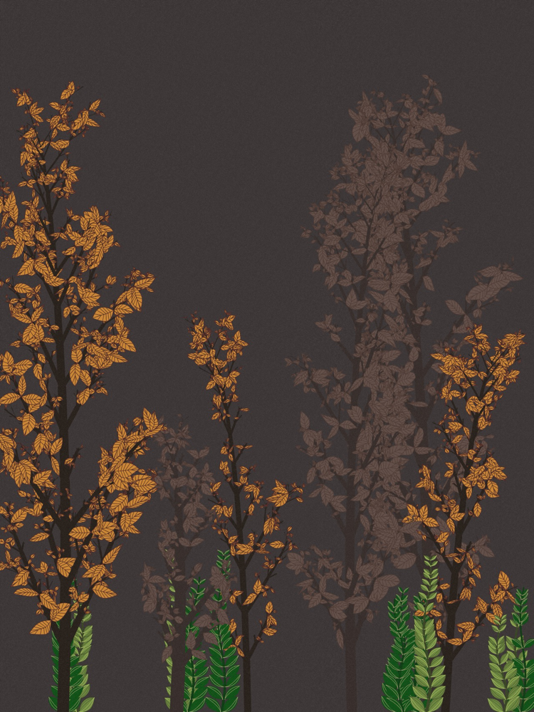

# p5.js 学习

[查看英文](./README.md)

这个仓库专门于分享我的 p5.js 作品和任何关于 p5.js 的知识。

这个仓库包含很多例子，比如以下几个大类。

- 植物、风景编码的思路
- 文本效果
- 几何图案
- 循环动画
- 音乐可视化
- 生成艺术
- 自然系统的模拟
- 机器学习 API
- 数学
- 其他

本仓库涵盖了非常广泛的话题供您参考。如果你打算开始学习 p5.js，你就来对地方了。

---

## 目录

### [艺术类](./P5_Art/README.md)

像风景画、植物画、抽象画和其他用 p5.js 创作的艺术作品都会放在这个目录里。

| 001_MountainAtNight                           | 002_Lotus                           | 005_ColorTree                           |
| --------------------------------------------- | ----------------------------------- | --------------------------------------- |
|  |  |  |

### [文本类](./P5_Font/README.md)

与文本相关的 p5.js 作品将放在这个目录中。

| 001_WoolFont                            | 002_NeonFont                            | 003_TextPosterLoopAnimation                            |
| --------------------------------------- | --------------------------------------- | ------------------------------------------------------ |
|  |  |  |

| 004_TextParticleLoopAnimation                            | 005_TextFlowAnimation                            | 006_TextMatrixAnimation                            |
| -------------------------------------------------------- | ------------------------------------------------ | -------------------------------------------------- |
|  |  |  |

### [几何图案](./P5_Geometric_Pattern/README.md)

在 p5.js 中通过使用算法重新排列或重新组合一些几何图形，让它们具有视觉美感。

| 001_TriangleNestedPattern                                         | 002_RectangleComposition                                         |
| ----------------------------------------------------------------- | ---------------------------------------------------------------- |
|  |  |

### [数学](./P5_Math/README.md)

用 p5.js 完成的一些数学实验将放在这个目录中。

| 001_Lissajous                            |     |
| ---------------------------------------- | --- |
|  |     |

### [音乐可视化](./P5_Music_Visualization/README.md)

所有 p5.js 音乐作品都将放在这个目录中。

| 001_RandomCurve                                           | 002_SoundWaves                                           |
| --------------------------------------------------------- | -------------------------------------------------------- |
|  |  |
